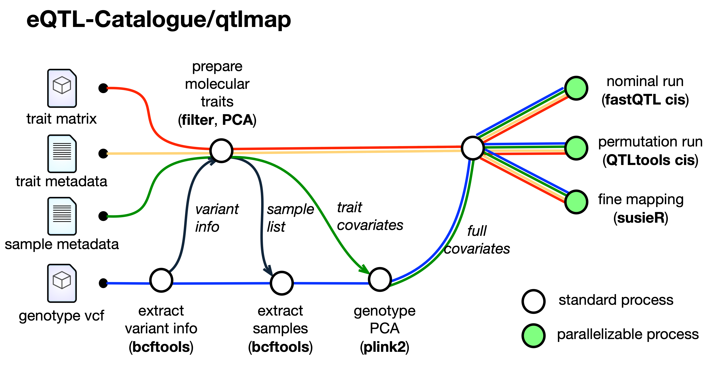

# eQTL-Catalogue/qtlmap
**Portable eQTL analysis and statistical fine mapping workflow used by the eQTL Catalogue**

[](https://www.nextflow.io/)
[](http://bioconda.github.io/)

### Introduction

**eQTL-Catalogue/qtlmap** is a bioinformatics analysis pipeline used for QTL Analysis.

The workflow takes phenotype count matrix (normalized and quality controlled) and genotype data as input, and finds associations between them with the help of sample metadata and phenotype metadata files (See [Input formats and preparation](docs/inputs_expl.md) for required input file details). To map QTLs, pipeline uses [QTLTools's](https://qtltools.github.io/qtltools/) PCA and RUN methods. For manipulation of files [BcfTools](https://samtools.github.io/bcftools/bcftools.html), [Tabix](http://www.htslib.org/doc/tabix.html) and custom [Rscript](https://www.rdocumentation.org/packages/utils/versions/3.5.3/topics/Rscript) scripts are used.

The pipeline is built using [Nextflow](https://www.nextflow.io), a bioinformatics workflow tool to run tasks across multiple compute infrastructures in a very portable manner. It comes with docker / singularity containers making installation trivial and results highly reproducible.


### Documentation
The eQTL-Catalogue/qtlmap pipeline comes with documentation about the pipeline, found in the `docs/` directory:

1. [Installation](docs/installation.md)
2. Pipeline configuration
    * [Local installation](docs/configuration/local.md)
    * [Adding your own system](docs/configuration/adding_your_own.md)
3. [Input formats and preparation](docs/inputs_expl.md)
4. [Running the pipeline](docs/usage.md)
5. [Troubleshooting](docs/troubleshooting.md)

<!-- TODO nf-core: Add a brief overview of what the pipeline does and how it works -->

### Pipeline Description
Mapping QTLs is a process of finding statistically significant associations between phenotypes and genetic variants located nearby (within a specific window around phenotype, a.k.a cis window)
This pipeline is designed to perform QTL mapping. It is intended to add this pipeline to the nf-core framework in the future.
High level representation of the pipeline is shown below:



### Results
The output directory of the workflow contains the following subdirectories:

1. PCA - genotype and gene expression PCA values used as covariates for QTL analysis.
2. sumstats - QTL summary statistics from nominal and permutation passes.
3. susie - SuSiE fine mapping credible sets.
4. susie_full - full set of susie results for all tested variants (very large files).
5. susie_merged - susie credible sets merged with summary statistics from univariate QTL analysis.

Column names of the output files are explained [here](https://github.com/eQTL-Catalogue/eQTL-Catalogue-resources/blob/master/tabix/Columns.md).

## Test usage

1. download repository
```shell
git clone git@github.com:MiqG/qtlmap.git
```

2. download dbSNP datbase for finemapping
```shell
wget "https://zenodo.org/records/15170247/files/dbSNP_b151_GRCh38p7_parquet.tar.gz?download=1" -O dbSNP_b151_GRCh38p7_parquet.tar.gz
tar -zxvf dbSNP_b151_GRCh38p7_parquet.tar.gz
rm dbSNP_b151_GRCh38p7_parquet.tar.gz
```

3. run small test
```shell
nextflow run main.nf \
    -profile singularity \
    -resume \
    --studyFile testdata/multi_test.tsv \
    --rsid_map_file rsid_map/rsid_map_file.tsv \
    --max_memory 10.GB \
    --max_time 2.h \
    --max_cpus 1 \
    -c <(echo "process { withName: make_pca_covariates { cpus = 1 } }") \
    --sumstat_sort_cores 1 \
    --sumstat_sort_mem "4G" \
    --cis_window 1000000 \
    --mincisvariant 5 \
    --n_geno_pcs 3 \
    --n_pheno_pcs 3 \
    --run_permutation TRUE \
    --n_permutations 1000 \
    --vcf_has_R2_field FALSE \
    --n_batches 25 \
    --run_susie TRUE \
    --write_full_susie FALSE \
    --outdir testdata/test_results/
```

4. run with eQTL Catalogue settings
```shell
nextflow run main.nf \
    -profile singularity \
    -resume \
    --studyFile testdata/multi_test.tsv \
    --rsid_map_file rsid_map/rsid_map_file.tsv \
    --max_memory 10.GB \
    --max_time 2.h \
    --max_cpus 1 \
    -c <(echo "process { withName: make_pca_covariates { cpus = 1 } }") \
    --cis_window 1000000 \
    --n_geno_pcs 6 \
    --n_pheno_pcs 6 \
    --run_permutation TRUE \
    --n_batches 400 \
    --mincisvariant 5 \
    --n_permutations 1000 \
    --run_susie TRUE \
    --write_full_susie FALSE \
    --outdir testdata/test_results/
```

## Usage tips

### Large `.vcf.gz` files

By default, the pipeline parameters `vcf_set_variant_ids` and `vcf_extract_samples` are set to TRUE. These steps make sure that the `.vcf` file is stardardized for everything to run smoothly. However, they also imply processing and writing almost the whole file several times, which are operations that are hard to predict how much they can last without trying.

Hence, to skip these steps (setting `vcf_set_variant_ids` and `vcf_extract_samples` to FALSE), it is recommended to preprocess the vcf before running the pipeline with these `bcftools` commands. Note that they require a file with the `sample_names.txt` (values in `genotype_id` column in `sample_metadata.tsv` file) to consider:

```shell
# create chr_map.txt
cat > chr_map.txt <<'EOF'
chr1 1
chr2 2
chr3 3
chr4 4
chr5 5
chr6 6
chr7 7
chr8 8
chr9 9
chr10 10
chr11 11
chr12 12
chr13 13
chr14 14
chr15 15
chr16 16
chr17 17
chr18 18
chr19 19
chr20 20
chr21 21
chr22 22
chrX X
chrY Y
chrM M
EOF
```

```shell
# the following:
# 1 - considers only sample_names
# 2 - renames chromosomes to remove 'chr'
# 3 - adds standard ID
# 4 - adds information for each variant with +fill-tags
# 5 - filters by allele frequency

THREADS=10
INPUT_VCF="raw.vcf.gz"
PREP_VCF="fineprep.vcf.gz"
SAMPLE_NAMES="sample_names.txt"
CHR_MAP="chr_map.txt"

nice bcftools view --threads $THREADS --samples-file $SAMPLE_NAMES $INPUT_VCF -Ou | \
    bcftools annotate --threads $THREADS --rename-chrs $CHR_MAP -Ou | \
    bcftools annotate --threads $THREADS --set-id 'chr%CHROM\_%POS\_%REF\_%FIRST_ALT' -Ou | \
    bcftools +fill-tags --threads $THREADS -Ou | \
    bcftools view --threads $THREADS -i 'AN[0]*MAF[0]>5 & MAF[0]>0.01' -Oz -o $PREP_VCF

nice bcftools index --threads $THREADS --tbi $PREP_VCF
```

# Contributors
* Nurlan Kerimov
* Kaur Alasoo
* Masahiro Kanai
* Ralf Tambets
* Krista Freimann
