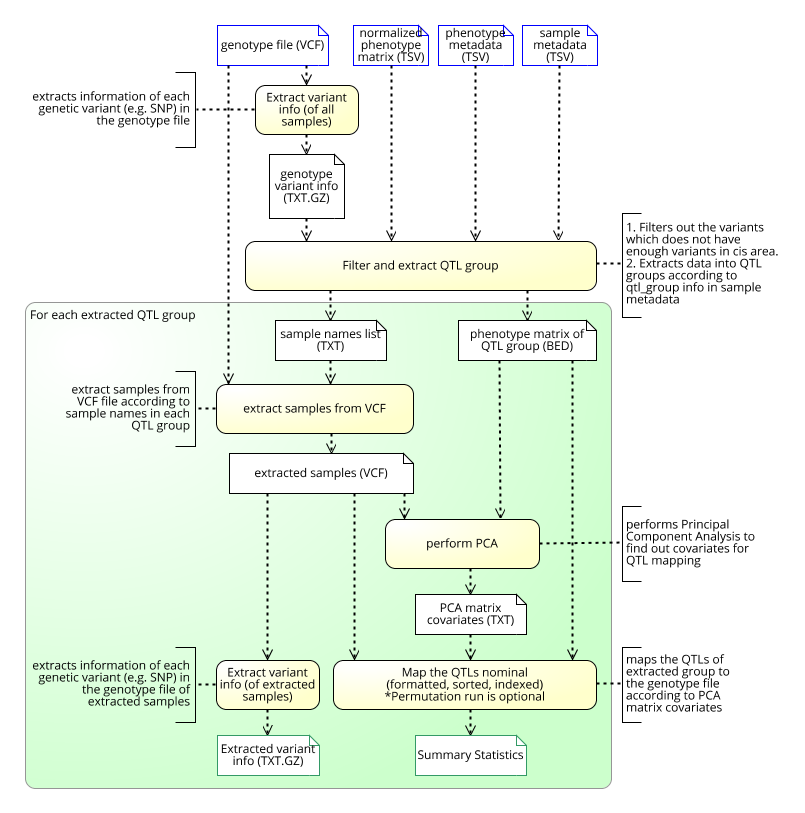

# nf-core/qtlmap
**This pipeline mapping "Quantitive Trait Loci"-s**

### Introduction
The pipeline is built using [Nextflow](https://www.nextflow.io), a workflow tool to run tasks across multiple compute infrastructures in a very portable manner. It comes with docker / singularity containers making installation trivial and results highly reproducible.

### Documentation
The kerimoff/qtlmap pipeline comes with documentation about the pipeline, found in the `docs/` directory:

1. [Installation](docs/installation.md)
2. Pipeline configuration
    * [Local installation](docs/configuration/local.md)
    * [Adding your own system](docs/configuration/adding_your_own.md)
3. [Input formats and preparation](docs/inputs_expl.md)
4. [Running the pipeline](docs/usage.md)
5. [Troubleshooting](docs/troubleshooting.md)

<!-- TODO nf-core: Add a brief overview of what the pipeline does and how it works -->

### Pipeline Description
Mapping QTLs is a process of finding statistically significant associations between phenotypes and genetic variants located nearby (within a specific window around phenotype, a.k.a cis window)
This pipeline is designed to perform QTL mapping. It is intended to add this pipeline to the nf-core framework in the future.
High level representation of the pipeline is shown below:

### Credits
kerimoff/qtlmap was originally written by Nurlan Kerimov under supervision of [Kaur Alasoo](https://github.com/kauralasoo)
