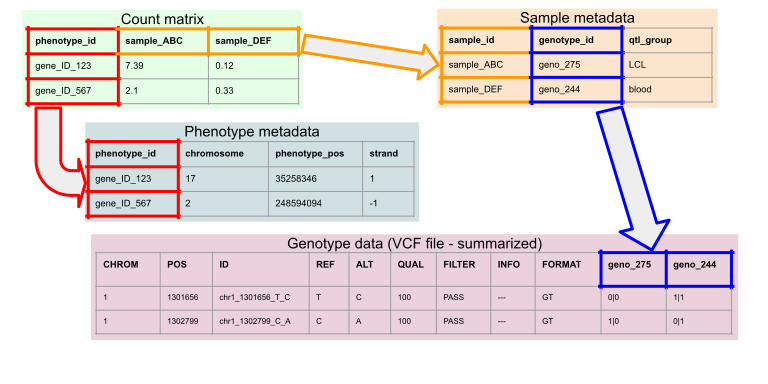

# kerimoff/qtlmap: Input files explanation

This pipeline requires 4 mandatory input files:

* **Phenotype Count Matrix (.tsv)**: Is the tab separated tabular data file which contains normalized and quality controlled phenotype counts. Should contain at least the following columns: **_phenotype_id_**. Example of count matrix is [here](../testdata/GEUVADIS_cqn.tsv)

* **Sample Metadata (.tsv)**: Is the tab separated tabular data file which contains metadata of the samples represented in phenotype count matrix. Should contain at least the following columns: **_sample_id, genotype_id, qtl_group_**. Example of Sample Metadata can be found in [here](../testdata/GEUVADIS_sample_metadata.tsv)

* **Phenotype Metadata (.tsv)**: Is the tab separated tabular data file which contains metadata of the phenotypes represented in phenotype count matrix. Should contain at least the following columns: **_phenotype_id, chromosome, phenotype_pos, strand, gene_id, group_id_**. Example of Phenotype Metadata can be found in [here](../testdata/GEUVADIS_phenotype_metadata.tsv). It is recommended to use phenotype metadata designed for eQTL Catalogue project which can be found [here](https://zenodo.org/record/3366011#.X_SNWOkzbuY) 

* **Genotype data (VCF or VCF.gz)**: Is the VCF file which contains genotypic data of the all samples represented in phenotype count matrix. Data column names of the VCF file should correspond to the _**genotype_id**_ column values of sample_metadata. Example of genotype data can be found in [here](../testdata/GEUVADIS_genotypes.vcf.gz).

## Relationships between input files are shown below.

